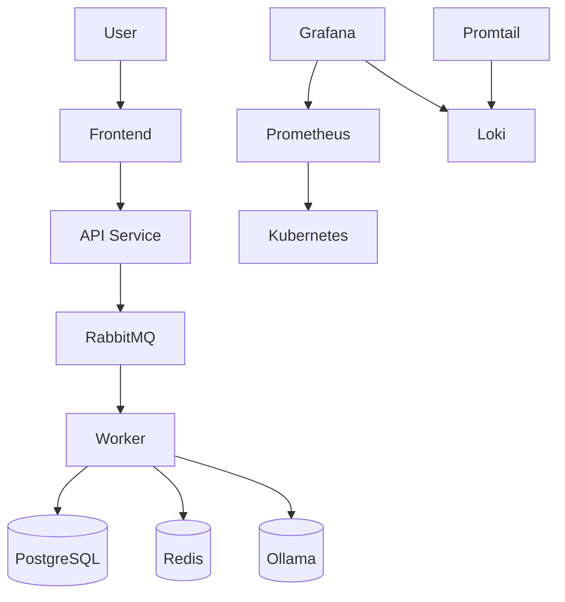

# AI File Analysis Platform

## Overview

AI File Analysis Platform is a Kubernetes-based microservices platform for asynchronous document processing and AI-powered analysis.

The system accepts PDF, Excel, and DOCX files, processes them through a message queue, stores metadata and results in PostgreSQL, and provides full observability through monitoring and centralized logging.

This project demonstrates production-oriented DevOps practices including Kubernetes orchestration, Helm packaging, CI/CD automation, monitoring, logging, autoscaling, and infrastructure management.

---

## Architecture



---

## Services

| Service        | Purpose                                       |
| -------------- | --------------------------------------------- |
| Frontend       | User web interface                            |
| API Service    | Request handling and orchestration            |
| Auth Service   | JWT authentication and authorization          |
| Worker Service | Background document processing                |
| PostgreSQL     | Persistent data storage                       |
| Redis          | Cache, sessions, JWT blacklist, rate limiting |
| RabbitMQ       | Asynchronous task queue                       |
| Ollama         | Local AI inference                            |
| NGINX Ingress  | External traffic routing                      |

---

## Technology Stack

### Infrastructure

* Kubernetes
* Helm
* Docker
* Docker Hub
* NGINX Ingress Controller

### Backend

* Python
* FastAPI
* PostgreSQL
* Redis
* RabbitMQ
* Ollama

### Observability

* Prometheus
* Grafana
* Loki
* Promtail

### CI/CD

* GitHub Actions
* Self-Hosted Runner

---

## DevOps Highlights

* Designed and deployed a microservices platform on Kubernetes
* Packaged the entire application using Helm
* Implemented GitHub Actions CI/CD pipeline
* Configured a Self-Hosted GitHub Runner
* Automated Kubernetes deployments with Helm
* Implemented Horizontal Pod Autoscaling (HPA)
* Configured centralized logging using Loki and Promtail
* Implemented monitoring using Prometheus and Grafana
* Managed application configuration with ConfigMaps and Secrets
* Provisioned persistent storage using PersistentVolumeClaims (PVC)

---

## Kubernetes Features

### Namespace Isolation

Separate environments:

* dev
* staging
* production

### Deployments

Implemented for all services with:

* Rolling Updates
* Replica Management
* Liveness Probes
* Readiness Probes

### Configuration Management

Managed using:

* ConfigMaps
* Secrets

Examples:

* Database configuration
* JWT secrets
* Service configuration

### Persistent Storage

PersistentVolumeClaims are used for:

* PostgreSQL data
* Uploaded files
* Ollama models

### Ingress Controller

NGINX Ingress provides:

* Frontend routing
* API routing
* Authentication service routing

### Horizontal Pod Autoscaler

Worker service automatically scales based on CPU utilization.

Configuration:

* Minimum Replicas: 1
* Maximum Replicas: 5
* Target CPU Utilization: 50%

---

## Helm Chart

The entire application is packaged as a reusable Helm Chart.

### Helm Features

* Parameterized Deployments
* ConfigMap Templates
* Secret Templates
* Ingress Templates
* HPA Templates
* PVC Templates
* Environment-Specific Configuration

### Example Deployment

```bash
helm install ai-platform ./ai-platform -n dev
```

Custom ingress hosts:

```bash
helm install ai-platform ./ai-platform \
  -n staging \
  --set ingress.appHost=app-staging.local \
  --set ingress.apiHost=api-staging.local \
  --set ingress.authHost=auth-staging.local
```

---

## Monitoring

Monitoring stack deployed using kube-prometheus-stack.

### Metrics

* CPU Usage by Pod
* Memory Usage by Pod
* Pod Restarts
* Running Pods
* Failed Pods
* Pending Pods
* Worker Utilization
* Ollama Resource Usage

### Components

* Prometheus
* Grafana
* Node Exporter
* kube-state-metrics

---

## Centralized Logging

Implemented using Loki and Promtail.

### Features

* Kubernetes Pod Log Collection
* Centralized Log Storage
* Grafana Log Exploration
* Label-Based Filtering
* Multi-Service Log Aggregation

### Components

* Loki
* Promtail
* Grafana

---

## CI/CD Pipeline

GitHub Actions automatically performs:

1. Python validation
2. Helm validation
3. Docker image build
4. Docker image push
5. Helm deployment
6. Rollout verification

### Pipeline Flow

```text
Git Push
   ↓
GitHub Actions
   ↓
Python Validation
   ↓
Helm Validation
   ↓
Docker Build
   ↓
Docker Hub
   ↓
Helm Upgrade
   ↓
Kubernetes Deployment
   ↓
Rollout Verification
```

### Published Images

* cherroman/api
* cherroman/auth
* cherroman/frontend
* cherroman/worker

---

## Redis Usage

Redis is used for production-like functionality.

### File Status Cache

Stores processing states:

* uploaded
* processing
* completed

### JWT Blacklist

Stores invalidated JWT tokens.

### Rate Limiting

Limits excessive API requests.

### Session Management

Stores active user sessions.

---

## Project Status

### Implemented

* Kubernetes Deployments
* Services
* ConfigMaps
* Secrets
* Persistent Volumes
* Ingress Controller
* Horizontal Pod Autoscaler
* Helm Packaging
* Monitoring (Prometheus + Grafana)
* Centralized Logging (Loki + Promtail)
* GitHub Actions CI/CD
* Self-Hosted Runner

### Completion

**10/10 planned platform requirements implemented.**

---

## Future Improvements

* Terraform Infrastructure as Code
* Multi-Node Kubernetes Cluster
* TLS Certificates with Cert-Manager
* ArgoCD GitOps Deployment
* Blue/Green Deployments
* Automated Backup Strategy
* Cloud Deployment (AWS / Azure)

---

## Author

Roman Chernukha

Production-inspired Kubernetes platform demonstrating Helm-based deployments, CI/CD automation, observability, autoscaling, and microservices architecture.
